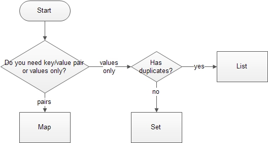

# Collections
java notes for [GradeBook](../Gradebook/src/Gradebook.java)



## Choose the right Java Map interface

**HashMap**
* use this implementation if the `order` of items while iterating is not important to you
* HashMap has better performance compared to TreeMap and LinkedHashMap

> **Key Point’s of HashMap class:**
1. It may have one null key and multiple null values.
2. It maintain no order.
3. It contain values based on the key.
4. It contains only unique elements.
5. Default capacity is 16 and load factor is 0.75f

**TreeMap**
* is ordered and sorted but slower compared to HashMap
* TreeMap has ascending order of keys, according to its Comparator

**LinkedHashMap**
* it orders items by key during insertion

## Choose the right Java List interface

**ArrayList**
* items are ordered during insertion
* search operations on ArrayLists is faster compared to search operations on LinkedLists

**LinkedList**
* has fast adding to the start of the list, and fast deletion from the interior via iteration

## Choose the right Java Set interface

**HashSet** 
* use this implementation if the order of items while iterating is not important to you. HashSet has better performance compared to TreeSet and LinkedHashSet

**LinkedHashSet** 
* it orders items during insertion

**TreeSet**
* has ascending order of keys, according to its Comparator

**source**: [Choose the Right Java Collection](https://javatutorial.net/choose-the-right-java-collection)

---

### Using for each to iterate through a HashMap</summary>
<mark>This is the advised approach.</mark> It gives you full control over the keys and values in the map. With this approach you actually iterate through the EntrySet of the map and you get the key and value of each entry inside the loop.

```java
import java.util.HashMap;
import java.util.Map;
public class IterateHashMap {
	public static void main(String[] args) {
		Map<String, String> map = new HashMap<String, String>();
		map.put("key1", "value1");
		map.put("key2", "value2");
		for (Map.Entry<String, String> entry : map.entrySet()) {
		    System.out.println(entry.getKey() + " = " + entry.getValue());
		}
	}
}
```

</details>


----

|             | Class | Package | Subclass | Subclass | World  |
| ----------- | :---: | :-----: | :------: | :------: | :----: |
| public      |   +   |    +    |    +     |    +     |   +    |
| protected   |   +   |    +    |    +     |    +     | &nbsp; |
| no modifier |   +   |    +    |    +     |  &nbsp;  | &nbsp; |
| private     |   +   | &nbsp;  |  &nbsp;  |  &nbsp;  | &nbsp; |


## References
* [Preventing NullPointerException](https://en.wikibooks.org/wiki/Java_Programming/Preventing_NullPointerException#For_each_loop_trap)
* [Java HashMap Tutorial with Examples](https://www.callicoder.com/java-hashmap/)
* [Collections](https://web.stanford.edu/class/archive/cs/cs108/cs108.1092/handouts/02SCollections.pdf)
* [Exception Handling](http://web.cse.ohio-state.edu/cse1223/slides/09ExceptionHandling.pdf)
* [resource for commenting](http://pages.cs.wisc.edu/~cs302/resources/guides/commenting.html#ClassHeader)
* [Hashing (cs.princeton.edu)](http://www.cs.princeton.edu/~rs/AlgsDS07/10Hashing.pdf)
* GeeksforGeeks
  * [Top 20 Hashing Technique based Interview Questions](https://www.geeksforgeeks.org/top-20-hashing-technique-based-interview-questions/)
  * [Hashing in Java](https://www.geeksforgeeks.org/hashing-in-java/)

